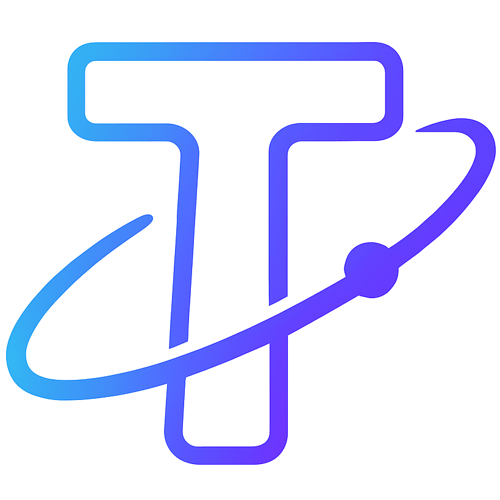

#  ToolUniverse Public Release Kit

This directory is a curated, ToolUniverse-only bundle for sharing the Codex plugin work, setup guides, skills, and prompt history in one place.

It is intentionally limited to ToolUniverse content:

- no `tooluniverse-mcpb/` temporary work area
- no `PLAN.md`
- no `INTERIM_PLAN.md`
- no unrelated repository folders or files
- no committed API keys, tokens, passwords, or `.env` files

## What Is Included

- `INSTALLATION.md` - beginner-friendly setup guide for macOS, Windows, Codex in VS Code, and the Codex app
- `SKILLS.md` - summary of the skills used during the ToolUniverse MCPB and Codex plugin work
- `PROMPTS.md` - merged prompt archive for the main implementation phases
- `skills/` - public, relative-path copies of the ToolUniverse-specific skills
- `assets/tooluniverse-logo.png` - ToolUniverse logo asset

## What This Bundle Is For

Use this bundle when you want:

- a shareable setup guide for ToolUniverse
- a compact explanation of the Codex plugin path
- a reusable record of the skill workflow that was used to build and validate the plugin
- a clean prompt archive that groups the many small working prompts into a few larger phases

## Recommended Reading Order

1. `INSTALLATION.md`
2. `SKILLS.md`
3. `PROMPTS.md`
4. `skills/README.md`

## Notes

- The production Codex plugin still lives under `plugins/tooluniverse/`.
- The repo-local marketplace path remains `./.agents/plugins/marketplace.json`.
- The supported personal-local Codex install path remains the one validated during the project.
- If Codex warns that only `MCPs` are available, check whether the plugin install path is enabled rather than adding a second standalone server.
